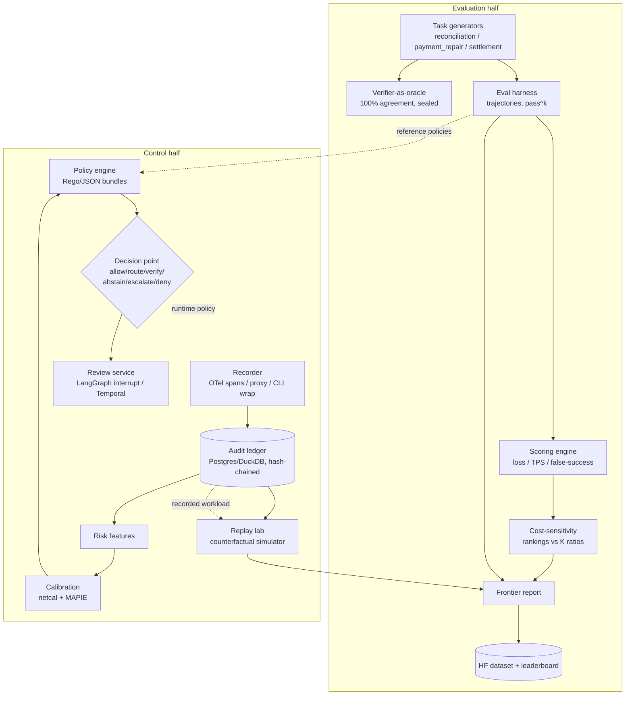
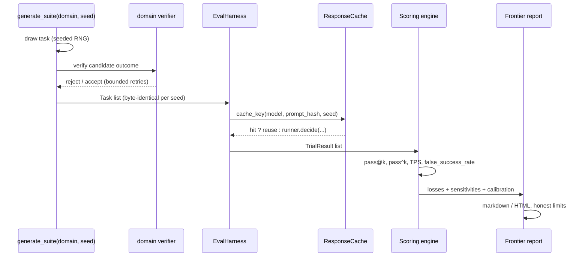
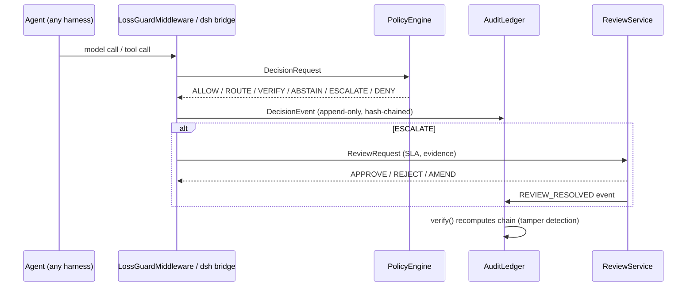

# LossBench — Architecture

Expected-loss evaluation and control for agents that touch money.

This document is the complete technical reference: system diagram, data flows,
module map, contracts, and deployment modes. Design rationale lives in
`docs/superpowers/specs/2026-08-14-regretbench-design.md`; the staged build plan
and status log live in `docs/IMPLEMENTATION.md`.

## 1. System overview

LossBench is one project with two halves sharing one trajectory contract.

- **Evaluation half (the benchmark)**: seeded task generators with
  verifier-as-oracle, outcome-verified scoring (pass^k, TPS, false-success
  detection), severity-weighted loss, cost-sensitivity analysis, and the
  frontier report. Public artifact: dataset + leaderboard on Hugging Face.
- **Control half (the control plane)**: record -> calibrate -> decide ->
  escalate -> replay. Library, CLI, HTTP service, and harness adapters
  (LangGraph middleware, dsh plugin bridge) that consume and produce the same
  `DecisionEvent` contract.



## 2. The metric (one paragraph)

`K(σ)` is the business cost of a failure at severity σ, from a versioned,
sourced `CostProfile`. Every decision has calibrated risk `p̂` and total cost:

```
TotalLoss(π, τ) = Σ_t [ K(σ_t)·1[error at t]   (unreviewed errors only)
                     + escalate_cost·1[escalated at t]
                     + judge_cost·1[judge invoked]
                     + price(model_m(t)) ]
```

The control decision is Bayes-optimal: route to the model minimizing
`p̂·K + price`, escalate when expected avoided loss exceeds review cost. The
flat-cost theorem (H0) is an executable test: when K is flat, loss ranking
equals accuracy ranking — everyone's current scoreboard is the flat-K special
case.

## 3. Data flows

### 3.1 Benchmark flow (offline, deterministic)



### 3.2 Control flow (online, policy-driven)



### 3.3 Replay flow (offline counterfactual, zero LLM calls)

```text
recorded DecisionEvents (ledger / JSONL)
        |
        v
ReplayLab.simulate(events, policy, new_threshold)
        |  deterministic re-decision of every event
        v
ReplayOutcome { before_loss, after_loss,
                before_review_load, after_review_load,
                total_before, total_after, per_case_diff }
```

The flagship demo: "re-run last month under a different risk policy" — flip a
threshold, replay the recorded workload, read the counterfactual cost.

## 4. Module map

| Package | Module | Responsibility |
|---|---|---|
| `lossbench.schema` | `schema.py` | Contract registry: `DecisionEvent`, `Task`, `DecisionRequest/Response`, `CostProfile`, `PolicyBundle`, `Severity`, `DecisionKind` |
| `lossbench.decision` | `decision.py` | Bayes core: `bayes_route`, `escalate_iff`, `expected_escalation_gain` |
| `lossbench.metrics` | `loss.py`, `coverage.py`, `calibration.py`, `deferral.py`, `sensitivity.py` | Pure loss math, risk-coverage curves, ECE/Brier, escalation quality, cost-sensitivity/ranking-stability |
| `lossbench.costs` | `registry.py`, `registry_data.py`, `profiles/*.yaml`, `data/registry.yaml` | Versioned cost profiles + 10-entry empirical severity-cost registry |
| `lossbench.generate` | `reconciliation.py`, `payment_repair.py`, `settlement.py`, `taxonomy.py` | Seeded generators with verifier-as-oracle, task signatures |
| `lossbench.contamination` | `monitor.py` | SHA-256 signature overlap, leak detection, false-fire checks |
| `lossbench.cache` | `store.py` | Byte-identical response cache (DuckDB), hit-rate accounting |
| `lossbench.calibrate` | `methods.py`, `pipeline.py` | Temperature/Platt/isotonic calibration; ledger-label -> policy fitting |
| `lossbench.features` | `extract.py` | Risk feature extraction (per-event + trajectory aggregates) |
| `lossbench.policy` | `bundle.py`, `engine.py`, `fit.py` | YAML policy loading, decision engine (5-rule precedence), threshold fitting |
| `lossbench.runners` | `base.py`, `stub.py`, `openai_compat.py`, `register.py`, `baselines.py` | Model runner protocol; stub; OpenAI-compatible; baseline registry |
| `lossbench.record` | `recorder.py`, `proxy.py` | OTel span recorder, event_from_trace, OpenAI-compatible proxy |
| `lossbench.cli` | `main.py`, `commands.py` | `lossbench` CLI: metrics, costs, decide, simulate, version |
| `lossbench.ledger` | `store.py` | Append-only audit ledger with SHA-256 hash chain, tamper verification |
| `lossbench.scoring` | `tps.py`, `passk.py`, `false_success.py` | Trajectory Proper Score; outcome-verified pass@k/pass^k; false-success rate |
| `lossbench.eval` | `harness.py` | Agent-mode evaluation harness with caching and domain verifier dispatch |
| `lossbench.replay` | `simulator.py` | Counterfactual policy replay (deterministic, no LLM calls) |
| `lossbench.hitl` | `review.py` | Review requests/resolutions backed by the ledger |
| `lossbench.adapters` | `langgraph.py`, `dsh/plugin.py` | LangGraph middleware; dsh plugin bridge + manifest |
| `lossbench.report` | `generator.py`, `templates.py`, `frontier.py` | Markdown/HTML report rendering; frontier report assembly |
| `lossbench.server` | `app.py`, `store.py` | Multitenant FastAPI decision service |
| `lossbench.util` | `canonical.py`, `determinism.py` | Canonical JSON, hashing, seed policy |
| `packaging/hf` | `exporter.py`, `eval.yaml` | HF Community Evals registration + dataset card packaging |
| `packaging/dsh` | `plugin.manifest.json` | dsh plugin manifest template |

## 5. Contract registry (stable interfaces)

| Type | Purpose | Key fields |
|---|---|---|
| `DecisionEvent` | Append-only record of one decision point | `event_id`, `trace_id`, `trajectory_id`, `tenant_id`, `prompt_hash`, `model_id`, `calibrated_probability`, `expected_loss`, `decision`, `policy_id`, `cost_model_id`, `token_usage`, costs, `evidence_hash` |
| `Task` | Benchmark task; must pass its domain verifier | `id`, `domain`, `prompt`, `initial_state`, `gold`, `severity`, `verifier`, `cost_model_ref`, `signature` |
| `DecisionRequest/Response` | Policy point I/O | request: `tenant_id`, `task_type`, `proposed_action`, `risk_features`, `available_models`; response: `decision`, `selected_model`, `requires_human`, `expected_loss` |
| `CostProfile` | Versioned, sourced `K(σ)` | `severity_costs[LOW..CRITICAL]`, `escalate_cost`, `judge_cost`, `sources` |
| `PolicyBundle` | Versioned policy | `escalation_threshold`, `model_tiers`, `allowlist`, `deny`, `spend_cap` |

Conventions (ratified):

- Severity of an event lives in `observed_outcome["severity"]` (risk_features
  is float-typed by contract).
- The canonical calibrated-risk key in `risk_features` is `calibrated_p`.
- Judge cost is subtracted only when conditionally invoked; unconditional
  judge cost cancels in policy comparisons.
- Policy logic lives ONLY in `PolicyEngine`; the CLI and adapters delegate.

## 6. Cost model flow

```text
data/registry.yaml (empirical anchors, sourced)
        |
        v
registry_data.py -> profile_from_registry(event_type, scale)
        |
        v
profiles/*.yaml (flat, reconciliation, principal_risk, review_heavy)
        |
        v
CostProfile -> metrics (loss, coverage, sensitivity) -> DecisionEngine
        |
        v
cost-sensitivity curves: conclusions shown ACROSS a K range (never one K)
```

## 7. Deployment modes

| Mode | Surface | When |
|---|---|---|
| Embedded | `PolicyEngine` + `LossGuardMiddleware` in-process | Inside LangGraph/Deep Agents apps |
| CLI | `lossbench record/decide/simulate/evaluate/report` | Wrap any agent, zero code |
| Proxy | `lossbench proxy` / `run_proxy` (OpenAI-compatible) | Capture without code changes |
| Service | FastAPI `/v1/decide`, `/v1/tenants/{id}/...` | Multitenant, policy-isolated decisioning |
| Plugin | `lossbench-dsh` bridge + manifest | DeepSeek Harness (via JS shim -> HTTP bridge) |
| Review | `ReviewService` on the audit ledger | HITL with SLA, durable, audit-able |

## 8. Reproducibility & integrity

- Seeded generation; same seed => byte-identical suites (tested per domain).
- Canonical JSON + SHA-256 everywhere (evidence, prompts, inputs, chain).
- Contamination monitor: overlap 0 on clean, 1.0 detection on injected leaks.
- Hash-chained audit ledger with tamper verification (`verify()`).
- Policy-only counterfactuals: deterministic, zero LLM calls.
- Paired seeded trials; per-seed envelopes; honest-limits sections.
- H0 theorem test (flat K => loss ranking == accuracy ranking) is executable.

## 9. Known gaps (tracked in IMPLEMENTATION.md)

- P2.9 Drift monitor (design C4: loss-distribution drift + online
  recalibration triggers) — specced in the design, not yet built.
- Buzz collaboration projection (design spec §10.5) — optional, week-11+,
  outbox + verified resolution callback.
- P3 release artifacts: leaderboard Space, interactive demo, model
  fine-tune runs, blog post, arXiv paper.
