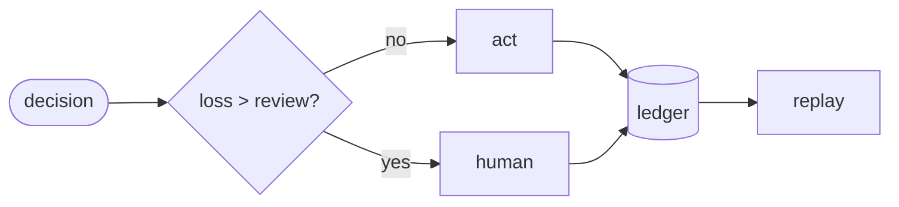

Every agent system I know is scored twice. Once for how often it is right, and once for how much it costs to ask. The two numbers sit on separate dashboards, and the gap between them is where the money leaks out.

The routing formula everyone is converging on makes this explicit. NVIDIA's Switchyard benchmark — the one where 93% of agent calls go to a 30B open model for 10.4% of the spend — reduces routing viability to a single inequality: the judge's cost divided by the price gap between the two models. If the cheap model is cheap enough relative to the expensive one, routing pays for itself. In their own numbers: Opus alone cost $11.45 per run of the 145-task suite; routing cut it to $3.00 — 74% cheaper — for a loss of six accuracy points (86.0 to 80.0), and the judge itself ate 21.2% of the routed spend, the second-largest line item after the frontier model. That formula has no term for the consequence of an error. A wrong answer costs nothing in it, regardless of whether the wrong answer moves a $5 million wire, approves a chargeback, or files a return with the wrong beneficiary. The formula treats "six accuracy points" as a fixed toll you pay for savings, never asking what those six points are worth.

Six accuracy points is not a number; it is six percent of your errors. What those errors cost depends entirely on where they land. On a workload of 800 exceptions a month, six points is about 48 mistakes. If they land on high-severity cases at the going rate, they are worth 48 times the cost of a missed principal; if they land on duplicates, they are worth almost nothing. The industry's scoreboards have the same hole. Benchmarks score correctness. Routers optimize price and quality. Gateways enforce spend and rate limits. None of them price the failure. None of them can answer the question that actually decides whether an agent should be allowed to act at all: what does it cost when this system is wrong, and are we routing around that cost or straight through it?

## The assumption everyone shares

The absence of an error-cost term is not an oversight in one vendor's formula. It is a structural assumption that the whole measurement culture inherited and never examined: that accuracy and price are the two numbers that matter, and everything else is a detail.

That assumption has a shape. A benchmark is built from tasks with ground-truth answers, and a model is scored by the fraction it gets right. The metric is the incentive: model makers optimize it, procurement reads it, and deployment inherits it. If the metric is correctness, then correctness is what gets optimized, and every other property of the system — whether it is calibrated, whether its failures cluster on expensive cases, whether it knows when to escalate — becomes someone else's problem. The layer between "how often the model is right" and "how much the automation is worth" was never instrumented, and it is exactly the layer where operational loss lives.

This is the quiet assumption, and it is the same one in every layer of the stack. Selective prediction research stops at the answer level: abstain when uncertain, measured by risk-coverage curves, with no severity structure. Agent benchmarks score task completion — pass^k, reliability across trials — and treat every failure as equally costly. Cost-sensitive classification exists but only in binary-screening settings like literature review, where the result is already striking: in 55% of the studies examined, cost-weighting changed which model was best. Gateways can tell you how many tokens a tenant spent and how fast; none of them can tell you that this customer's errors cost ten times more than that customer's, so their escalation threshold should differ.

The layers grew separately, each rational within its own boundary, and the boundary between them is where the cost of being wrong was allowed to go unmeasured. Nobody owns that layer. It is the largest unowned measurement space in the agent stack, and it sits precisely on top of the systems that will move money.

## What expected loss actually is

The alternative is not a new model or a new framework. It is a different objective, stated plainly: a production agent should estimate the cost of being wrong, choose an execution strategy accordingly, stop before irreversible harm, escalate when appropriate, and produce evidence that the policy worked.

Formally, it is small. Let K(σ) be the business cost of a failure at severity σ. Let p̂ be the calibrated probability of that failure. A single auto-decision costs p̂·K(σ) in expectation; a reviewed decision costs the reviewer's time. Escalating is worthwhile exactly when the expected avoided loss exceeds the review cost. Routing among models is the same shape: pick the model that minimizes p̂·K(σ) plus its price. That is Bayes decision theory from 1970, no new math.

The reason it is not already in use is not the math. It is that the inputs were never built. A calibrated p̂ requires a calibration loop that most production systems do not have — the calibration essay I wrote earlier makes the case that confidence scores are usually unmeasured, and routing on uncalibrated confidence is worse than routing randomly. A defensible K(σ) requires sourced, contested, versioned cost figures, which nobody publishes. And a measurement that shows severity changes the answer requires a benchmark whose ground truth can be trusted, which is a rare artifact.

The theorem at the center of all of it is embarrassingly simple, and it explains the entire industry: when all severities cost the same, expected loss ranking is identical to accuracy ranking. Every leaderboard in the field is measuring the flat-cost special case without saying so. The divergence between the accuracy-optimal policy and the loss-optimal policy grows monotonically with cost asymmetry — with how wrong it is to treat a missed $5 million wire the same as a missed duplicate. We ship this as an executable test (`tests/test_flat_cost_theorem.py` in the repo): when severity is flat, our metric agrees with everyone else's. When it is not, it does not. That disagreement is the product.

## Why the divergence is not theoretical

It is tempting to read this as a philosophical point that evaporates in practice. It does not, for a structural reason: in operational systems, error costs are not merely unequal, they are skewed by orders of magnitude.

The project ships four cost profiles, and the spans between severities are not cosmetic. They are the load-bearing assumption, stated where everyone can contest it:

| profile | LOW | MEDIUM | HIGH | CRITICAL | span |
|---|---|---|---|---|---|
| `flat` | 1 | 1 | 1 | 1 | 1× |
| `reconciliation` | 0.2 | 1.0 | 10 | 50 | 250× |
| `review_heavy` | 1 | 5 | 50 | 250 | 250× |
| `principal_risk` | 1 | 10 | 1,000 | 100,000 | **100,000×** |

A reconciliation exception is a good example because the asymmetry is legible. An amount mismatch on a principal transfer is principal at risk; a duplicate is a rebook at worst. A missed high-severity exception costs fifty times a missed duplicate under any sane cost model, and the ratio is not an opinion — it is anchored in what the failure does. Fedwire transfers average in the millions; a misrouted one is a $1M–$10M incident class. The US payments machine moves $140 trillion a year; an ACH credit averages $3,881; the fraud multiplier says every dollar of fraud loss costs the merchant $3.75 in total costs. Basel capitalizes operational risk for exactly these event classes, which means banks already carry capital for the errors we are scoring. None of these numbers are subtle. The asymmetry is not a corner case; it is the definition of the domain.

When the asymmetry is that large, the scoreboard changes. Here is the divergence made arithmetic. Take 10,000 reconciliation decisions a month, 800 of them exceptions — 500 HIGH, 200 MEDIUM, 100 LOW, at the shipped `reconciliation` weights (10 / 1.0 / 0.2). Two models with the same number of monthly decisions:

| | Model A (even errors) | Model B (severity-shaped) |
|---|---|---|
| errors on HIGH | 10 | 2 |
| errors on MEDIUM | 4 | 40 |
| errors on LOW | 2 | 20 |
| total errors / accuracy | 16 / **98.0%** | 62 / **92.25%** |
| expected loss, `reconciliation` K | 104.4 | **64.0** |
| expected loss, `principal_risk` K | 10,042 | **2,420** |

Model B is five and three-quarter points less accurate. Under the reconciliation cost model it still loses 39% less money. Under the principal-risk model — large-value settlement, where HIGH is 1,000 and CRITICAL 100,000 — it loses 76% less. Which model is better is not a capability question; it is a question about which scoreboard you believe. And the scoreboard you believe is decided by the cost model you can defend.

We measured exactly this divergence in the previous project. A 1.7B model fine-tuned in about a hundred minutes on a laptop beats a frontier model on severity-weighted recall on an 800-task benchmark, 0.913 to 0.872, while losing raw accuracy 0.805 to 0.876 — the frontier model gets more tasks exactly right and loses the ones that cost money. The small model catches every high-severity exception (1.000 recall across all four HIGH classes), parses 100% of 800 outputs where the frontier misses 0.4%, and averages 38 tokens per verdict with zero reasoning-token overhead and zero API cost. The same measured divergence the WMCC studies found at scale: cost-weighting flips the best model in a majority of cases.

The implication is uncomfortable for procurement. If the metric is accuracy, you buy the frontier model. If the metric is expected loss, you buy the small fine-tuned one, deploy it on your own hardware, and spend the savings on review capacity. The decision between them is not a capability question. It is a question about which scoreboard you believe, and the industry currently has only one scoreboard to look at.

## Why nobody owns it

The measurement layer for expected loss is empty for a reason: each of its inputs belongs to a different discipline, and no discipline had an incentive to complete the picture.

Selective prediction theory owns p̂ — the abstention threshold, the risk-coverage curve — but it stopped at the answer level, where severities do not exist. Routing research owns the price term and published a formula that is embarrassingly explicit about excluding everything else. Benchmarks own the tasks but score completion, not consequence. Gateways own the runtime but enforce spend, not risk. Regulators — SR 26-2 replaced SR 11-7 this year with guidance written for modern modeling, and the EU AI Act's high-risk obligations are landing — demand documented, logged, overseen systems, but they cannot demand a metric nobody has built. The compliance tail is wagging an uninstrumented dog.

The empty layer is exactly where a benchmark and a control plane can live without colliding with any incumbent, because no incumbent is trying to answer the question. A benchmark that scores severity-weighted expected loss, with ground truth nobody can dispute, becomes the thing model cards cite and the thing routing papers are measured against. A control plane that consumes the same contracts becomes the thing risk committees can examine. The two halves share one trajectory record — every decision, its calibrated risk, its cost, its policy revision — which is what makes the measurement both auditable and replayable. You can re-run last month's workload under a different escalation threshold, deterministically, with zero model calls, and read the counterfactual cost. That sentence did not exist anywhere before this project, as far as I can tell. Not in the routing papers, not in the gateways, not in the observability platforms. The platforms went to sleep on accuracy drift; the whole category of consequence-weighted drift — errors flat, cost rising — is unmonitored everywhere.

## What it takes to own it

None of this is hard because the math is hard. It is hard because every input has to be built with the discipline to be trusted, and trust is a property you cannot bolt on afterward.

Ground truth comes first. A benchmark is only as good as its labels, so the generator is paired with an independent verifier that recomputes the answer from the fields alone, never reading the label the generator attached, and every task must pass before it is admitted. One hundred percent agreement, enforced by code. The benchmark is seeded; the same seed produces byte-identical tasks forever. Train and evaluation splits are signature-checked against each other; contamination is a monitored quantity, not a hope. If a benchmark's numbers cannot be reproduced by a stranger, the benchmark is a press release, and the field has had enough of those.

Calibration is the hinge. The whole control loop assumes p̂ means something, so calibration is a first-class output — ECE, reliability curves, per-policy-version — and the pipeline refits thresholds from labeled outcomes that arrive through the ledger. The honest acknowledgment: our first local judge measured a kappa of 0.3672 on a rubric fix that fixed a frontier judge to 0.9037. The failure is published, and the fix — a judge-specific fine-tune, not more prompting — is a named workstream. This is the culture of the project, not an accident of it. Negative results are kept because they are the evidence that the positive ones are real. The B2 study is the same discipline: rebalancing the training mix toward the rare classes collapsed severity-weighted recall from 0.913 to 0.723 — cutting a class's training share destroys its recall, and upsampling a subtle-signal class buys nothing. Kept, published, and the design carries the lesson: training distribution must match deployment distribution.

Cost models are the contested part, and they are treated as such. K(σ) is a versioned, sourced input — a registry of empirical anchors with citations and confidence levels, plus pluggable profiles, plus the rule that every conclusion must be shown across a range of K, never at one chosen K. The registry (`src/lossbench/costs/data/registry.yaml` in the repo) currently holds ten entries across five domains, each with a low/typical/high range and a source: misposted ACH at ~$3,881 typical (Federal Reserve Payments Study 2024); misrouted wire at $1M–$10M (Fedwire Funds Services); fraud at $3.75 per dollar of loss (LexisNexis True Cost of Fraud); a missed SAR at $1M–$100M (FinCEN, enforcement actions); a false-positive AML review at $3–10 (LexisNexis True Cost of AML Compliance); insurance fraud at $308.6B a year (Coalition Against Insurance Fraud); a manual prior-authorization touch at $12.43 against $2.56 electronic (CAQH Index); Medicare improper payments around 6% — roughly $40B a year (CMS); and settlement failure at $100k–$1B (BIS). If your severity costs differ from ours, you substitute yours and rerun; the analysis must be stable enough to survive that. The claim is never "these are the true costs." The claim is "here is what the ranking does as costs vary," which is the only claim that can be defended.

Around that core sits the control plane: record every decision into an append-only, hash-chained ledger; calibrate from labeled outcomes; decide under a versioned policy; escalate through durable review workflows with SLAs; monitor drift on the loss distribution itself; replay any alternative policy against the recorded history. Every decision is an auditable record with its policy revision, model revision, prompt hash, and expected loss attached. This is what SR 26-2-style examination looks for, and it is also, less glamorously, what makes the counterfactual demo possible: you cannot re-run last month under a different policy unless last month was recorded.

## The significance, concretely

The significance is not that we built a benchmark. It is that the benchmark changes which decisions the industry can make defensibly.

First order: it changes which model wins. Severity-weighting flips the best model in a majority of studied cases; our measured divergence is a 1.7B laptop fine-tune beating a frontier model on the money metric while losing on accuracy. A procurement team with a severity-weighted scoreboard buys differently. That is not an aesthetic difference; it is millions of dollars of inference spend, and it is the difference between a small model that runs in-bank behind a data-residency wall and a frontier API call that leaves the building.

Second order: it changes what an agent is allowed to do unattended. The escalation threshold stops being a tuned-by-vibes constant and becomes a policy derived from measured costs — a documented, versioned, counterfactually-evaluated decision about how much risk the system is allowed to take autonomously. That is the actual autonomy boundary, and it was previously arbitrary. The control plane makes it a quantity.

Third order: it makes the failure mode legible to the people who will audit it. A regulator or risk committee does not need to trust a demo. They need to see that every decision was recorded with its policy version, its calibrated risk, its evidence, and its human resolution, and that the policy itself can be replayed and contested. That is the difference between "the model is right 87% of the time" and "here is what this system costs when it is wrong, and here is the policy we derived from it." The first is a claim. The second is an instrument.

There is a fourth order, and it is the one I care about most. Severity-weighting is the one axis where small models have a structural advantage over frontier economics. A frontier model distributes its errors evenly; a narrow fine-tuned model can be shaped to never miss the expensive class. The whole "tiny but mighty" story — a 1.7B model trained in two hours on a laptop, catching every high-severity exception on a benchmark, at zero API cost — is not a fluke of one fine-tune. It is the shape of the axis. The axis favors the small, the local, the domain-specialized, and the auditable, because it prices what the big model prices away. That inverts the current incentive structure for a whole class of deployments.

## Sources and links

Everything in this essay is measured or contested in public, and the rule of the project is that every headline number must be reproducible by a stranger:

- **Repository**: [github.com/caiotheodoro/lossbench](https://github.com/caiotheodoro/lossbench) — the benchmark, the control plane, and all 351 tests. `make validate` runs them; `make determinism` proves two full runs from the same seed are byte-identical.
- **The theorem, executable**: [tests/test_flat_cost_theorem.py](https://github.com/caiotheodoro/lossbench/blob/main/tests/test_flat_cost_theorem.py) — flat K ⇒ loss ranking equals accuracy ranking; and the property test that raising the cost of high-severity failures never lowers the optimal escalation rate.
- **The cost registry**: [src/lossbench/costs/data/registry.yaml](https://github.com/caiotheodoro/lossbench/blob/main/src/lossbench/costs/data/registry.yaml) — ten sourced anchors, five domains, ranges and citations.
- **The design**: [design spec](https://github.com/caiotheodoro/lossbench/blob/main/docs/superpowers/specs/2026-08-14-regretbench-design.md), [architecture](https://github.com/caiotheodoro/lossbench/blob/main/docs/ARCHITECTURE.md), [implementation plan](https://github.com/caiotheodoro/lossbench/blob/main/docs/IMPLEMENTATION.md).
- **The paper draft**: [lossbench-draft.md](https://github.com/caiotheodoro/lossbench/blob/main/docs/paper/lossbench-draft.md) — the metric science behind the essay.
- **The predecessor**: [a 1.7B model fine-tuned on a laptop beat DeepSeek on the metric that matters](https://caio.theodoro.dev/blog/reconforge-1-7b-beats-deepseek-on-the-money-metric), where the 0.913 vs 0.872 divergence was first measured.

## The honest assessment

The objections are real, and they should be stated plainly.

The data is synthetic. There is no live financial data, no real counterparties, no production loss history. The methodology is the subject, and the numbers are self-measured on a self-built benchmark — which is the point, because the measurement is the product, but it is also the limit. The severity costs are contested inputs, anchored in real figures with citations but assembled by one person. The local judge calibration gap is open. The benchmark's conclusions will be attacked, and some of the attacks will be right, and the design — pluggable costs, published negative results, reproducible runs — exists to survive the attacks that are.

There is a subtler risk. The moment a metric becomes the scoreboard, it becomes the target. If severity-weighted expected loss becomes standard, someone will game it — allocate costs to make their model look best, or shape a benchmark to flatter their weights. The defense is the same defense every honest benchmark has: ground truth nobody controls, contamination that is monitored, costs that are contestable, and negative results that are kept. The DavidAU lesson of this year — downloads without verifiable evals now actively hurt you — is the community enforcing exactly this. Trust is the scarce resource, and it is earned the slow way.

And the thesis itself is falsifiable, which is its strength. If it turns out that severity weighting rarely changes real-world rankings — if the flat-cost special case is the general case in practice — the entire project collapses into a well-engineered special case. That is why the flat-cost theorem is not an essay; it is an executable test in the repository. And the property tests go further: raising the cost of high-severity failures must never lower the optimal escalation rate. These are not vibes; they are assertions that run in CI and would fail loudly.

## The third number

The industry got very good at measuring two numbers: how often a model is right, and how much it costs to ask. It optimized both, publicly, competitively, and the optimization did its job — accuracy climbed and price fell. What never got measured is the third number: what it costs to be wrong. And the third number is the one that decides whether the automation is worth having at all.

The absence was not malice. It was inheritance — the scoreboard everyone assumed was the only scoreboard, passed down from a measurement culture built on multiple-choice correctness. But the assumption is load-bearing, and it is breaking in the exact place where the stakes are highest: the systems that will move money. A benchmark that scores the right objective, a control plane that enforces it, and a community that contests the inputs instead of trusting them — that is the difference between knowing how often the agent is right and knowing what the agent costs when it is not.

The metric you measure is the automation you get. We are proposing the third number. It is not the hardest metric to compute. It is the hardest one to have to look at.
